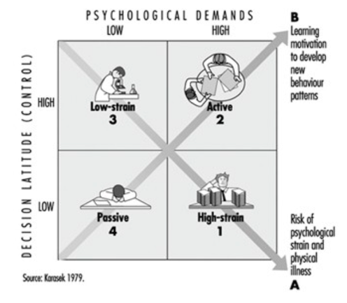
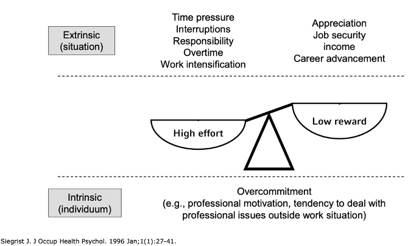
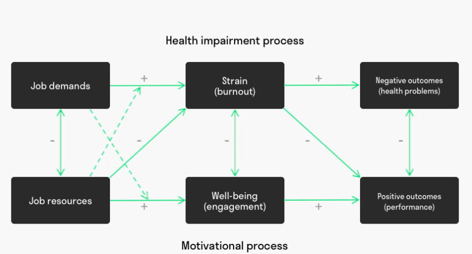
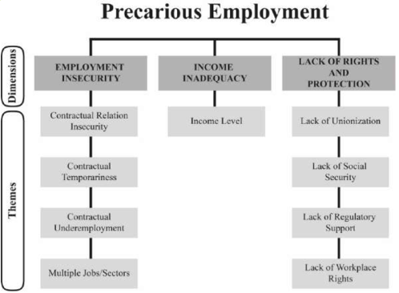

------------------------------------------------------------------------

# Introduction

## Occupational Health Aims

1.  Establishing the causes and determinants of work-related disease.
2.  Ensuring adequate recognition and quantification of work-related disease. Determining appropriate occupational exposure limits.
3.  Providing evidence for policy-makers

## Benefits for workers

1.  Reduction of work-related health risks, e.g., by reducing exposure levels.
2.  Elimination/substitution of hazards.
3.  Prevention
4.  Compensation (through recognition as an occupational disease)

## Benefits for society

1.  Reduction of environmental health risks
2.  Derivation and application of exposure limits 3.Reduction of the economic burden of work-related disease

### Work and Health: Psychosocial Conditions

1.  Demand-Control model - Karasek 1979

    {width="253"}

2.  Effort-Reward Imbalance model - Siegrist 1996

    {width="250"}

3.  Job-Demands-Resources model - Demerouti 2001

    {width="276"}

convincing findings on the associations of some psychosocial work factors with mental disorders and cardiovascular diseases.”\

## Precarious Work & Health

1.  Precarious work is a multidimensional construct that includes employment insecurity, income inadequacy, and lack of rights and protection in the workplace.

2.  Precarious work is associated with a range of adverse health outcomes, including mental disorders, cardiovascular diseases, and musculoskeletal disorders.

3.  The mechanisms linking precarious work to health outcomes are complex and may include stress, lack of social support, and exposure to hazardous working conditions.

4.  Interventions to reduce precarious work and improve working conditions may have significant benefits for worker health and well-being.

    {width="280"}

------------------------------------------------------------------------

# Study Instruments, Bias, and Confounding

------------------------------------------------------------------------

## Key Exam Concepts

Common exam questions include:

1.  What are the three alternative explanations for an observed association?
    -   Bias
    -   Confounding
    -   Chance
2.  What does non-differential misclassification cause?
    -   Bias toward the null.
3.  In which study design is recall bias most common?
    -   Case-control studies.
4.  What are the three criteria for a confounder?
    -   Associated with exposure
    -   Associated with outcome
    -   Not on the causal pathway
5.  Methods to control confounding?
    -   Restriction
    -   Stratification
    -   Multivariable regression

------------------------------------------------------------------------

## 1. Study Instruments

Common tools used in epidemiological research:

-   **Questionnaire**
    -   Measures exposure, outcome, and confounders
-   **Diary**
    -   Diet, activities, behaviors
-   **Registry data**
    -   Population registry, cancer registry
-   **Clinical examination**
    -   Anthropometric measurements (height, weight, blood pressure)
-   **Biomonitoring**
    -   Blood samples, biomarkers (e.g., blood lead concentration)
-   **Ambient sampling**
    -   Environmental exposure (e.g., dust samples)
-   **Job Exposure Matrix (JEM)**
    -   Expert-based occupational exposure estimation

Example: Exposure to lead → measured using **blood samples (biomonitoring)**

------------------------------------------------------------------------

## 2. Reliability vs Validity

### Reliability

Reliability refers to the **consistency of a measurement**.

If the measurement is repeated multiple times and produces similar results, it has high reliability.

Example: Repeated blood pressure measurements producing similar values.

### Validity

Validity refers to the **accuracy of a measurement**.

It indicates whether the measurement reflects the **true value**.

Example: A diagnostic test correctly identifying asthma patients.

### Classic Scenarios

| Situation | Interpretation |
|------------------------------------|------------------------------------|
| Reliable but not valid | Measurements are consistent but incorrect |
| Low reliability & low validity | Measurements are inconsistent and inaccurate |
| Reliable and valid | Measurements are both accurate and consistent |

------------------------------------------------------------------------

## 3. Why Study Results Might Be Incorrect

Observed associations may not represent the true causal relationship.

Three main alternative explanations:

-   **Bias**
-   **Confounding**
-   **Chance (random error)**

------------------------------------------------------------------------

## 4. Misclassification

Misclassification occurs when individuals are assigned to the wrong exposure or disease category.

Example: An exposed individual recorded as non-exposed.

### Non-differential Misclassification

Definition: Random measurement error affecting all groups equally.

Characteristics:

-   Same probability of misclassification in cases and controls.
-   Common in imperfect measurement instruments.

Effect:

Bias **toward the null** (effect estimate moves toward OR = 1).

Key exam statement:

Non-differential misclassification **attenuates associations**.

Solutions:

Improve measurement; Increase sample size.

### Differential Misclassification

Definition: Systematic measurement error affecting groups differently.

Characteristics:

-   Misclassification probability differs between cases and controls.

Effect:

May **overestimate or underestimate** the true association.

Result is **unpredictable**.

Solutions:

Improve measurement;Blind the observes and subjects to exposure/outcome/internvention status.

------------------------------------------------------------------------

## 5. Selection Bias

Definition:

Selection bias occurs when systematic differences exist between individuals selected for a study and those not selected.

This results in a study population that does not represent the target population.

### Types of Selection Bias

#### Sampling Bias

Occurs when the sampling strategy excludes certain groups.

Example:

Study question: Precarious work → depression

Sampling frame: Tax office income tax registry

Problem:

People with precarious employment may not pay taxes and are therefore not included.

Result:

Underrepresentation of the exposed group.

Effect:

**Underestimation of the risk factor**.

------------------------------------------------------------------------

#### Participation Bias (Non-response bias)

Occurs when participation differs according to exposure or outcome.

Example:

Case-control study:

Asbestos exposure → ovarian cancer

Participation rates:

Cases: 90% Controls: 50%

If low-exposure controls are less likely to participate:

Exposure prevalence in controls appears higher.

Effect:

**Underestimation of the true association**.

Participation bias may also lead to **overestimation** depending on participation patterns.

------------------------------------------------------------------------

## 6. Reducing Selection Bias

Methods to improve participation:

-   Send reminders
-   Provide incentives (vouchers)
-   Provide personal study results
-   Use priority mail
-   Increase perceived relevance of the study
-   Maintain contact with cohort participants

Assessing selection bias:

-   Compare responders and non-responders
-   Use registry data
-   Use non-responder questionnaires
-   Apply inverse probability weighting

------------------------------------------------------------------------

## 7. Recall Bias

Recall bias is a form of **information bias**.

Definition:

Systematic differences in the accuracy or completeness of participant recall.

Most common in **case-control studies**.

Example:

Study: Asbestos exposure → ovarian cancer

Exposure measurement: Self-reported questionnaire.

Cases may search for explanations for their disease and report exposures more often.

Controls have no such motivation.

Result:

Cases report higher exposure frequency.

Effect:

**Overestimation of the association**.

------------------------------------------------------------------------

## 8. Confounding

Definition:

Confounding occurs when the association between exposure and outcome is distorted by a third variable.

Example:

Coffee consumption → lung cancer

True confounder:

Smoking

Smokers drink more coffee and have higher lung cancer risk.

Coffee itself may not cause lung cancer.

------------------------------------------------------------------------

### Conditions for a Confounder

A variable is a confounder if it:

1.  Is associated with the exposure
2.  Is associated with the outcome
3.  Is not part of the causal pathway

------------------------------------------------------------------------

## 9. Identifying Potential Confounders

Strategies:

-   Review existing literature
-   Identify common confounders
    -   Age
    -   Sex
    -   Socioeconomic status
-   Apply subject-matter knowledge

Examples in occupational epidemiology:

-   Smoking
-   Physical fitness

------------------------------------------------------------------------

## 10. Confounding vs Effect Measure Modification

### Confounding

After stratification:

Association disappears.

Example:

Overall OR = 2.0

After stratifying by smoking:

OR = 1.0 in both strata.

Interpretation:

The observed association was due to confounding.

### Effect Measure Modification (Interaction)

The effect differs across strata.

Example:

Non-smokers: OR = 1.0 Smokers: OR = 4.0

Interpretation:

Smoking modifies the effect of the exposure.

Unlike confounding, effect modification should be **reported rather than controlled away**.

------------------------------------------------------------------------

## 11. Controlling for Confounding

Methods:

#### Restriction

Limit study population to one category.

Example:

Include only non-smokers.

Limitation:

Loss of generalizability.

#### Stratification

Analyze exposure-outcome association within strata of the confounder.

Example:

Stratify by smoking status.

#### Multivariable Analysis

Adjust for confounders using statistical models.

Examples:

-   Logistic regression
-   Cox regression
-   Linear regression

------------------------------------------------------------------------

## 12. Chance (Random Error)

Random variation may lead to incorrect conclusions.

Strategies to reduce chance:

-   Increase sample size
-   Perform statistical tests
-   Calculate confidence intervals

------------------------------------------------------------------------

## Clinical Pictures in Occupational and Environmental Medicine -- Study Guide

LMU Munich -- Occupational & Environmental Medicine

------------------------------------------------------------------------

## Part 1 -- Fundamentals of Occupational and Environmental Medicine

### Definition

Occupational and Environmental Medicine (OEM) studies the health effects of workplace and environmental exposures and focuses on:

-   Prevention
-   Diagnosis
-   Risk assessment
-   Exposure assessment
-   Population health protection

OEM differs from classical clinical medicine because it focuses strongly on prevention and population-level risks.

------------------------------------------------------------------------

## Global Burden of Occupational Disease

According to Global Burden of Disease (GBD) studies:

Contribution to global DALYs: - Behavioural risk factors: 32.7% - Metabolic risk factors: 16.8% - Environmental and occupational risk factors: 13.1%

### DALY Definition

DALY (Disability-Adjusted Life Year) is a measure of disease burden that combines:

DALY = Years of Life Lost (YLL) + Years Lived with Disability (YLD)

------------------------------------------------------------------------

## Major Occupational Risk Factors

Examples of occupational hazards:

Chemical carcinogens: - Asbestos - Arsenic - Benzene - Cadmium - Chromium - Nickel - Formaldehyde

Air pollutants: - Diesel engine exhaust - Polycyclic aromatic hydrocarbons (PAH) - Silica dust

Other exposures: - Noise - Ergonomic factors - Asthmagens

------------------------------------------------------------------------

## Work-Related Cardiovascular Mortality

Research estimated approximately 912,000 deaths globally related to occupational circulatory risks.

Important occupational cardiovascular risk factors: - Shift and night work - Engine exhaust exposure - Workplace noise - Environmental tobacco smoke

These exposures increase the risk of: - Ischemic heart disease - Stroke

------------------------------------------------------------------------

## Routes of Occupational Exposure

Three main exposure routes exist in occupational toxicology.

### 1 Inhalation

Most important exposure route.

Factors influencing inhalation toxicity: - Particle size - Gas solubility - Ventilation rate

Examples: - Silica dust - Asbestos fibers - Welding fumes

### 2 Dermal Exposure

Chemicals can penetrate intact skin.

Risk increases with: - Damaged skin - Solvents - Pesticides

### 3 Ingestion

Usually due to poor workplace hygiene.

Examples: - Eating at the workplace - Smoking with contaminated hands

------------------------------------------------------------------------

## Toxicological Determinants of Disease

Health effects of toxic substances depend on:

-   Substance characteristics
-   Exposure pattern (acute vs chronic)
-   Accumulation in the body
-   Balance between absorption and excretion
-   Balance between injury and repair
-   Immediate vs delayed effects
-   Reversible vs irreversible damage

Example: Asbestos exposure may cause mesothelioma after a latency of 20--40 years.

------------------------------------------------------------------------

## Part 2 -- Occupational Diseases by Organ System

### Respiratory Diseases

The respiratory system is the most commonly affected system in occupational disease.

Common occupational respiratory diseases:

-   Occupational asthma
-   Hypersensitivity pneumonitis
-   Chronic obstructive pulmonary disease (COPD)
-   Pneumoconiosis
-   Silicosis
-   Asbestosis

Typical exposures:

-   Wood dust (carpenters)
-   Flour dust (bakers)
-   Organic dust (farmers)
-   Animal proteins

------------------------------------------------------------------------

## Occupational Cancer

Common occupational cancer associations:

Leukemia → Benzene

Bladder cancer → Aromatic amines (aniline dyes)

Lung cancer → Asbestos, diesel exhaust

Mesothelioma → Asbestos

Skin cancer → UV radiation, tar

------------------------------------------------------------------------

## Skin Diseases

Occupational skin diseases are among the most common occupational illnesses.

Examples:

Contact dermatitis - Irritant dermatitis (solvents) - Allergic dermatitis (latex)

------------------------------------------------------------------------

## Neurological Toxicity

Important occupational neurotoxins include:

Lead → peripheral neuropathy

Mercury → neurotoxicity

Organic solvents → central nervous system damage

------------------------------------------------------------------------

## Other Occupational Diseases

Kidney diseases: - Heavy metals may cause renal failure

Cardiovascular diseases: - Carbon monoxide exposure - Occupational noise

Liver diseases: - Solvents - Vinyl chloride (associated with liver cancer)

------------------------------------------------------------------------

## Reproductive and Infectious Occupational Risks

Occupational exposures may affect fertility and pregnancy outcomes.

Examples: - Solvents → miscarriage - Heavy metals → infertility

Occupational infections occur in:

Healthcare workers: - Hepatitis - Tuberculosis

Farmers: - Zoonotic infections

Laboratory workers: - Pathogens

------------------------------------------------------------------------

## Prevention and Compensation

Occupational medicine has two central goals.

### Prevention

General prevention: - Exposure limits - Workplace regulations

Individual prevention: - Workplace risk assessment - Personal protective equipment (PPE)

### Compensation

Occupational diseases may be compensated through occupational insurance systems.

Example in Germany: Recognized occupational diseases (Berufskrankheiten, BK).

------------------------------------------------------------------------

## Occupational Health Clinics

Typical services include:

-   Lung function testing
-   Cardiopulmonary exercise testing
-   Allergology
-   Hearing tests
-   Vision tests
-   Biomonitoring

Occupational clinics also provide:

-   Workplace risk assessments
-   Medical expertise reports
-   Occupational disease diagnosis

------------------------------------------------------------------------

## Provocation Challenge Tests

Provocation tests are used to confirm whether a specific workplace exposure causes symptoms.

Examples:

Wood dust challenge → carpenters

Hairdresser exposure challenge → hair chemicals

Soldering flux challenge → colophony exposure

Purpose: To confirm the causal relationship between exposure and disease.

------------------------------------------------------------------------

## Part 3 -- Occupational Case Examples

Occupational clinics receive questions about:

Environmental exposures: - Mercury in dental fillings - Indoor mold exposure - Chemical odors causing vertigo - Cat allergens from previous tenants - Electromagnetic fields

Work ability assessments: - Disability after trauma - Fitness for work - Early retirement evaluation

------------------------------------------------------------------------

## Long Latency Occupational Diseases

Many occupational diseases develop decades after exposure.

Examples:

Mesothelioma Latency: 20--40 years

Lung cancer Latency: 20--30 years

Asbestosis Latency: decades

Therefore, historical workplace descriptions are important for diagnosis.

------------------------------------------------------------------------

## Occupational Medicine vs Clinical Medicine

Occupational Medicine: - Focus on populations - Prevention - Exposure assessment - Surveillance programs

Clinical Medicine: - Focus on individual patients - Diagnosis - Treatment - Prognosis

------------------------------------------------------------------------

## History of Occupational Cancer

### Bernardino Ramazzini (1633--1714)

Known as the father of occupational medicine.

He emphasized that physicians should always ask patients:

"What is your occupation?"

------------------------------------------------------------------------

### Percivall Pott (1775)

Discovered scrotal cancer among chimney sweepers.

Cause: Exposure to soot.

This was the first recognized occupational cancer.

------------------------------------------------------------------------

### Ludwig Rehn (1895)

Identified bladder cancer in workers exposed to aniline dyes.

Observation: 3 cases among 45 workers in an aniline factory.

This established the link between aromatic amines and bladder cancer.

------------------------------------------------------------------------

## Asbestos -- The Most Important Occupational Carcinogen

Diseases caused by asbestos:

-   Lung cancer
-   Mesothelioma
-   Asbestosis

Global estimates suggest approximately 107,000 deaths per year from asbestos exposure.

------------------------------------------------------------------------

## Asbestos Risk Estimates

Average risk estimates:

170 tons of asbestos consumption → 1 mesothelioma death

48 tons of asbestos consumption → 1 asbestos-related lung cancer death

------------------------------------------------------------------------

## Example -- Indonesia

Annual asbestos import: 150,000 tons

Predicted consequences: - \~882 mesothelioma deaths annually - \~3125 lung cancer cases annually

------------------------------------------------------------------------

## Global Asbestos Policy

Many international organizations support a global asbestos ban:

-   WHO
-   ILO
-   ICOH

------------------------------------------------------------------------

## Asbestos Ban

Germany banned asbestos in: 1993

European Union ban: 2005

Estimated impact: Approximately 24,000 lives saved in Germany.

------------------------------------------------------------------------

## Final Concept

Clinical cases are essential to understand:

-   Research needs
-   Exposure risks
-   Preventive strategies

Occupational medicine connects clinical medicine with public health prevention.

------------------------------------------------------------------------

